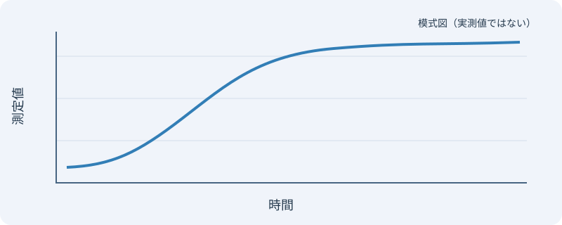

# キャプションなしと混在

## キャプションなしの表を横並びにする

内容に合った幅で中央寄せにします。横の間隔は `lgap`、縦の間隔は `vgap` です。

> [!grid|cols=2 lgap=32 vgap=16]
> | 直径   | 許容電流 |
> | ------ | -------- |
> | 1.6 mm | 27 A     |
> | 2.0 mm | 35 A     |
> | 2.6 mm | 48 A     |
> | 3.2 mm | 62 A     |
>
>| 断面積  | 許容電流 |
>| ------- | -------- |
>| 2.0 mm² | 27 A     |
>| 3.5 mm² | 37 A     |
>| 5.5 mm² | 49 A     |
>| 8.0 mm² | 61 A     |

## キャプションあり・なしの表と画像を混在させる

> [!grid|cols=2 lgap=24 vgap=32]
> | 直径 | 許容電流 |
> | --- | --- |
> | 1.6 mm | 27 A |
> | 2.0 mm | 35 A |
>
> > [!table] 断面積と許容電流
> > | 断面積 | 許容電流 |
> > | --- | --- |
> > | 2.0 mm² | 27 A |
> > | 3.5 mm² | 37 A |
>
> ![[example-apparatus.svg]]
>
> > [!figure] 測定結果
> > ![[example-results.svg]]
>
> 説明文は1行全体に表示します。

この本文はグリッドの外です。

## キャプションなしの画像を横並びにする

> [!grid|cols=2]
> ![[example-apparatus.svg]]
>
> 

## 画像の幅を指定する

> [!grid|cols=2 lgap=24 vgap=16]
> ![[example-apparatus.svg|180]]
>
> > [!figure] 測定結果
> > ![[example-results.svg|300]]
